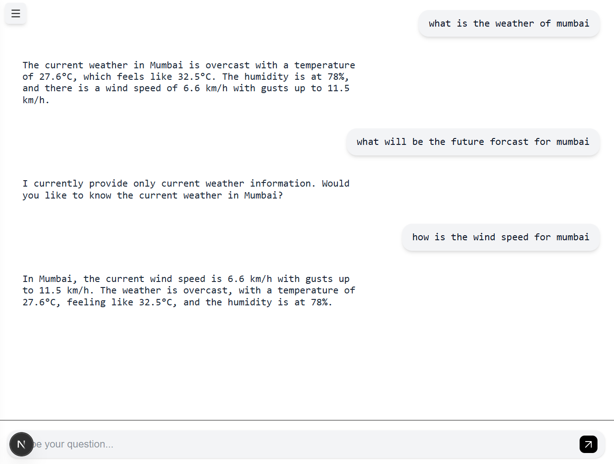
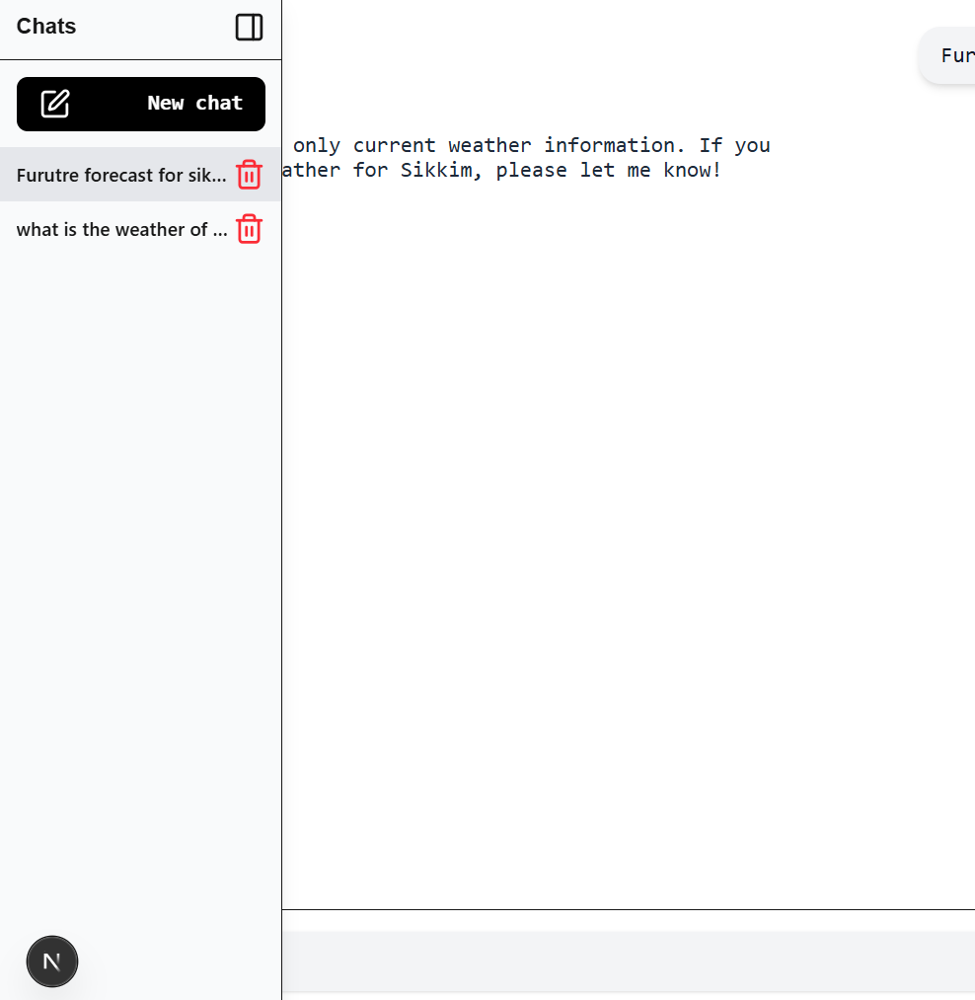
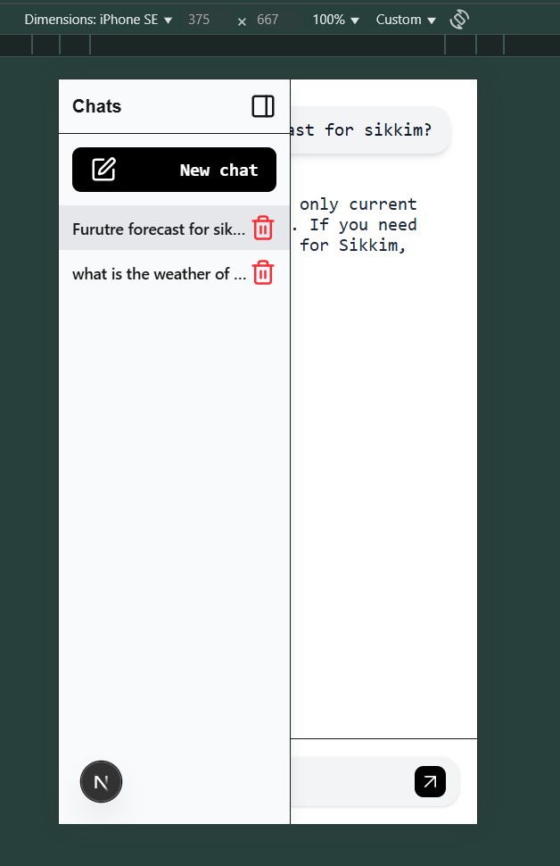
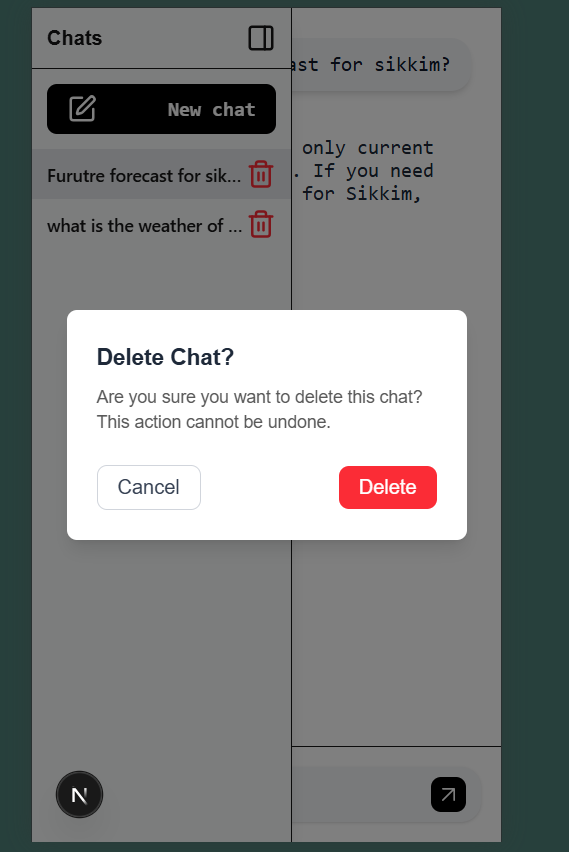

# Weather Agent Chat Interface

A responsive chat application built with **Next.js (App Router, TypeScript, Tailwind CSS, Framer Motion, and Lucide React)**.  
It connects to a **Weather Agent API** and provides a smooth, mobile-first chat experience with persistent local chat history.

---
## 🌐 Deployed Link

You can access the live application here: **[Deployed App Link](https://weather-agent-chatbot.vercel.app/)**

---

##  Tech Stack

- **[Next.js 14+](https://nextjs.org/)** – React framework with App Router
- **[TypeScript](https://www.typescriptlang.org/)** – Static typing
- **[Tailwind CSS](https://tailwindcss.com/)** – Utility-first styling
- **[Framer Motion](https://www.framer.com/motion/)** – Animations
- **[Lucide React](https://lucide.dev/)** – Modern icons
- **LocalStorage** – Persistent chat history
- **Weather Agent API** – Real-time weather responses via streaming

---

## 📸 Features & Screenshots

### 🔹 Chat Interface
- Send & receive messages in a clean interface.
- User messages align **right**, agent messages align **left**.
- Auto-scrolls to the latest message.



---

### 🔹 Persistent Chats (LocalStorage)
- Chats are stored locally in the browser.
- Sidebar shows all previous conversations.
- Create new chats or delete old ones.



---

### 🔹 Sidebar Toggle (Mobile Friendly)
- On **desktop** → Sidebar docked by default.
- On **mobile** → Sidebar slides in/out (Framer Motion).
- Overlay closes sidebar on tap.




---

### 🔹 Delete Confirmation
- Clicking **delete** shows a confirmation modal.
- Prevents accidental deletion of chats.



---

## ⚙️ How It Works

1. **API Integration**
   - Messages are sent to the Weather Agent API.
   - The API streams back responses in chunks.
   - Our parser extracts only the `"0": "..."` values to reconstruct agent replies.

2. **Local Storage**
   - Chats (`id`, `title`, `messages`) are saved under `chats` key.
   - User can load previous chats across sessions.

3. **Animations**
   - Sidebar uses **Framer Motion** to slide in/out.
   - Modal scales/fades in with animation.

---

## 🛠️ Setup & Installation

```bash
# Clone repo
git clone https://github.com/GaneshYadav3142/weather_agent_chatbot.git
cd weather_agent_chatbot

# Install dependencies
npm install

# Run dev server
npm run dev
